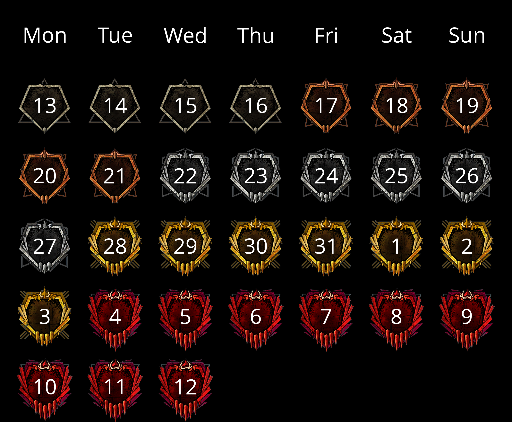

# Grade planner for Dead By Daylight

This is a tool that let you create plans for upgrading grades in Dead By 
Daylight like this:



## Main concept

Main goal of this tool is let to create something like a calendarfor upgrading 
grade step by step (yes, it becomes easier after recent update that not stole 
pips, but first version of this tool was created too far before this).

Each day in calendar is mark some grade: ash, bronze, silver etc. This mark 
means that you can live in this day with current grade or higher (you can get
bronze in 15th day from demo for example), but if your grade is lower, than 
you need to hurry up.

Days with same grades is called period. Each next period is longer by 1 day, 
except last that could be longer by 1-4 days because these days cannot be 
included in previous periods evenly, so it lets more days to relax or give 
reserve days to upgrade to last grade.

Whole plan starts and ends between 13th days of two close months (like in Dead 
By Daylight). Usually first period (ash) always contain 4 days, except every
February-March that contains 3 days.

## Installing

### Pre-requirements

#### Install Python

As this project written on Python, then you need to install it (3.12 or 
higher):
- [Windows and MacOS](https://www.python.org/downloads/)
- Linux, in most cases, already installed, but if it's not:

   ```commandline
  apt install python
   ```

Also for Linux, you must ensure that your installed Python have version 3.12 
or higher:

```commandline
python --version
```

If it's not (or you don't have python), then you should add repository that 
contains all versions of Python and install 3.12. For example, for Ubuntu, you 
can add deadsnakes repo and install Python 3.12 from it:

```commandline
sudo add-apt-repository ppa:deadsnakes/ppa
sudo apt update
sudo apt install python3.12
```

And then you should use command `python3.12` instead just `python`!

#### Downloading this project

There are 2 possible ways to do it:

1. Click "Code" -> "Download ZIP", unpack it anywhere. If you choose this way, 
you can go to "Installation" paragraph.
2. Using `git`.

#### Installing `git`

On Linux and MacOS `git` could be already installed, so before going to 
instructions, check it out by command in terminal:
   
```commandline
git --version
```
   
If you get `git` version - great! You can skip next instructions and go to 
"Downloading project with `git`" paragraph.
   
On different systems `git` installation is different: 
[Windows installer](https://git-scm.com/download/win),
[MacOS instructions](https://git-scm.com/download/mac),
[Linux instructions](https://git-scm.com/download/linux)
   
For Linux and MacOS after installation steps `git` should work.
   
For Windows, you must use git bash instead of `cmd.exe`.

#### Downloading project with `git`

Just use these commands:
   
```commandline
cd <path_where_you_want_to_install>
git clone https://github.com/Holography7/DBDPlanner.git
```

#### Installation

Project have installation scripts to make easier installation. Just use one of 
two scripts and just run it:
- For Windows: `install_windows.bat`. You can just double-click this file.
- For Linux and MacOS: `install_linux_and_macos.sh`. Probably you need to mark 
this file as executable to run it. It's recommends to run it from terminal to 
see logs:
```commandline
./install_linux_and_macos.sh
```

#### Manual installation

If for some reason you cannot or don't want to use script, you can install all 
dependencies manually:

1. Open console in project directory and use next commands to create virtual 
environment, then activate it:

   ```commandline
   python -m venv .venv
   .venv\Scripts\activate.bat  # Windows
   source .venv/bin/activate  # Linux and MacOS
    ```

2. Install dependencies. You can do it basically via `pip`:

    ```commandline
    pip install -r requirements.txt
    ```
   
   Or using `uv` which install dependencies faster:
    ```commandline
    pip install uv
    uv pip install -r requirements.txt
    ```

## Usage

**Important**: before usage of this project, you must activate virtual 
environment any time when you open terminal/console:

```commandline
.venv\Scripts\activate.bat  # Windows
source .venv/bin/activate  # Linux and MacOS
```

After this commands your terminal/console will start with `(.venv)` that means 
you activate virtual environment. Project works with only activated virtual 
environment!

Usage is pretty easy - just use next command to generate your plan on current
month:

```commandline
python create_plan.py
```

After some time you got message, that your plan was generated. All your plans
will store in `plans` directory.

For advanced usage you can generate plan on any other date. To do this, you
can use `-d` parameter and type date in ISO format between 13th days of two
months. For example, to make plan on May-June 2024, use this command:

```commandline
python create_plan.py -d 2024-05-13
```

Remember that type day before 13th day of any month, you get plan that starts 
in previous month. For example, date `2024-05-12` will creates plan on 
April-May 2024, not May-June!

## Settings

You can customize plan using `settings.toml` file. It contains next settings:

| Setting           | Description                                                            | Type                                  | Example value                                     |
|-------------------|------------------------------------------------------------------------|---------------------------------------|---------------------------------------------------|
| header_font       | Path to font file for header of plan. Supports only TTF.               | String                                | "fonts/OpenSans-Regular.ttf"                      |
| body_font         | Path to font file for numbers of days in plan. Supports only TTF.      | String                                | "/usr/share/fonts/truetype/freefont/FreeMono.ttf" |
| placeholders      | Path to directory where stores images of grades.                       | String                                | "images"                                          |
| plans             | Path to directory where save plans images.                             | String                                | "C:\plans"                                        |
| header_font_size  | Size of font in header of plan.                                        | Integer                               | 108                                               |
| body_font_size    | Size of font for numbers of days in plan.                              | Integer                               | 108                                               |
| header_text_color | Text color of header.                                                  | String or list with 3 integers        | "white"                                           |
| body_text_color   | Text color of numbers of days.                                         | String or list with 3 integers        | \[255, 255, 255\]                                 |
| background_color  | Background color.                                                      | String or list with 3 integers        | "black"                                           |
| plan_margins      | Size of margins from border of image to imaginary border of plan.      | Integer, list with 2, 3 or 4 integers | 50                                                |
| cell_paddings     | Size of paddings from border of cell to placeholder image inside cell. | Integer, list with 2, 3 or 4 integers | \[0, 0\]                                          |
| cell_size         | Size of cell in pixels                                                 | List with 2 integers                  | \[360, 360\]                                      |

Little meanings for some types:
- Any color setting could be set as list with 3 numbers of RGB colors from 0 to
255, or as string - color name like in HTML.
- Margins and paddings have similar definition in HTML: single number defines 
margins or paddings from all sides, list with 2 integers - top + bottom and 
left + right sides, 3 - top, left + right and bottom sides, 4 - top, right, 
bottom and left sides
- `cell_size` defines width and height

## Developing

This project contains requirements for developing (usual users not need them 
to install). To install them, use one of this command:

```commandline
pip install -r dev_tools.txt
uv pip install -r dev_tools.txt
```

It contains `ruff` linter and formatter, `mypy` type checker and `pre-commit` 
hook. You can install pre-commit hook to run `ruff` and `mypy` every time
before commit:

```commandline
pre-commit install
```

Or, run them manually:
```commandline
ruff check
ruff format
mypy .
```

## Testing

Project contains `test.py` script for running manual tests to generate some
parts of images. Use command `python test.py --help` to get information about 
available tests. You can also use `--help` after every available test to see
options. All test results stores in `src/tests/manual_test_results`. Also you 
can see what this tests do in `src/tests/manual.py`.

Auto tests will come someday...

## Roadmap

- [X] Testing on Windows and MacOS
- [X] Add settings
- [ ] Add auto tests
- [ ] Add updating
- [X] Add setup scripts
- [ ] Maybe add docker version?
- [ ] Add customization of mark
- [ ] GUI
